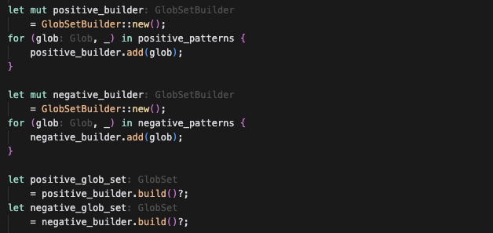

# Coding style

Rust has a formatting tool similar to prettier, [`rustfmt`](https://github.com/rust-lang/rustfmt), but, similar to Prettier, I prefer to not use it on this project. A package manager doesn't need a huge amount of rapidly evolving code, but it can have hairy parts. I prefer to optimize for readability over velocity when it comes to code formatting.

Tools like `rustfmt` are unfortunately a little too robotic for my taste, and while there are some things I'd like to enforce (like tab sizes), there are others that I think should be left to the appreciation of whoever is writing the code, with the assumption they'll take care to keep the change uniform with their neighbours.

I do have some guidelines though:

## `use crate::{...}`

Always write it on multiple lines:

```rust
use crate::{
    a,
    b,
    c,
};
```

Instead of:

```rust
use crate::{a, b, c};
```

## `let value = ...`

The rust-analyzer VSCode extension is pretty good at infering types from expressions and adding them as hints next to the variable name:



To make them easy to read, try to move the `=` operator to the next line:

```rust
let value
    = ...;
```

Instead of:

```rust
let value = ...;
```

> [!NOTE]
> One exception are `Path` expressions which I tend to start on the same line, but to be honest that feels very arbitrary and I should stop doing that.

## `match` arms

Use one of those two syntaxes:

```rust
match value {
    Some(value)
        => ...,

    None
        => ...,
}
```

Or:

```rust
match value {
    Some(value) => {
        ...
    },

    None => {
        ...
    },
}
```
