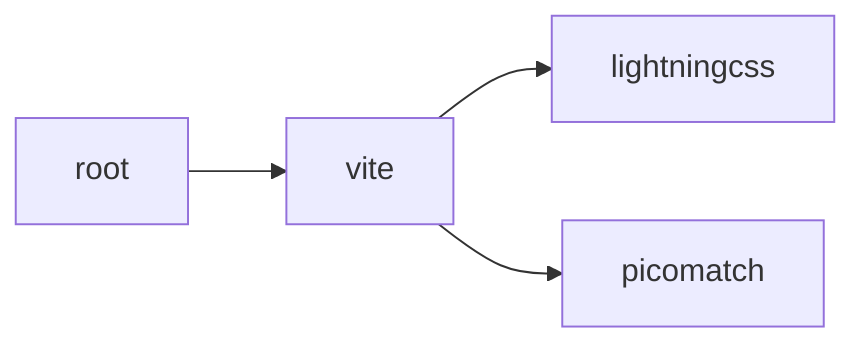
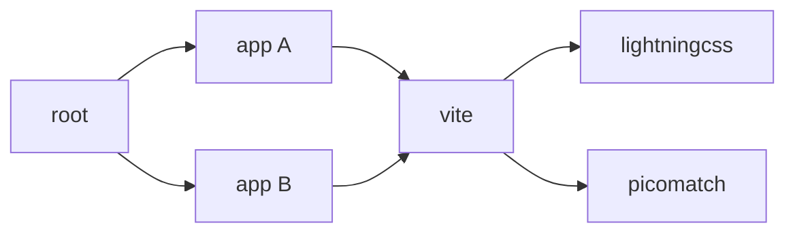
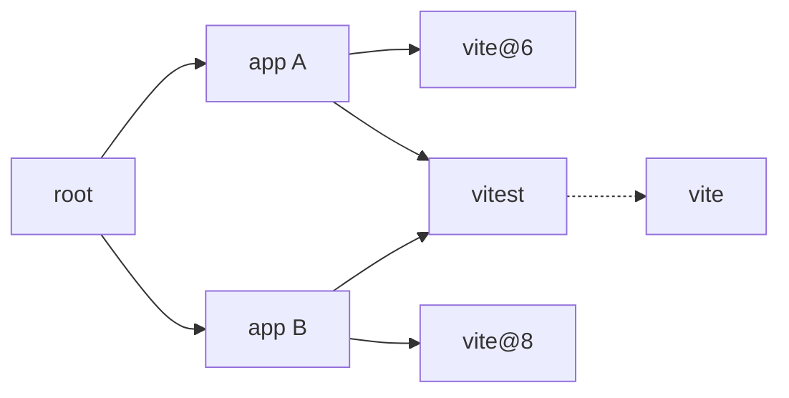
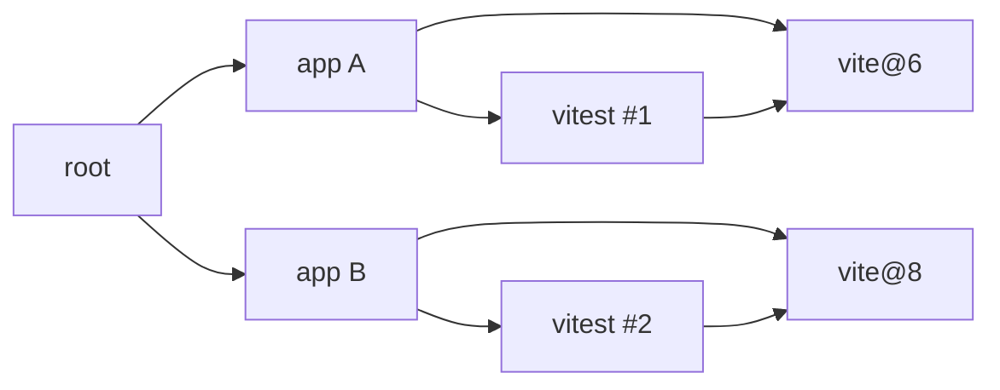
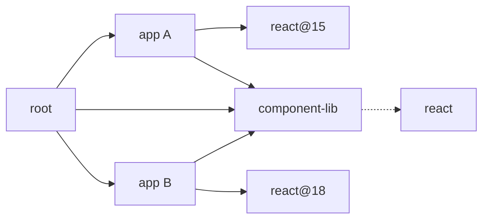
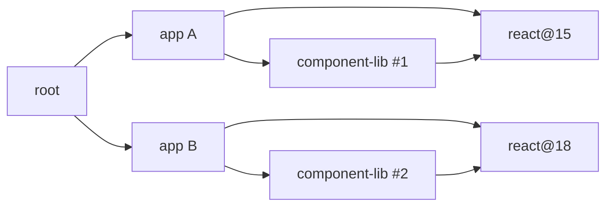

Leveraging everything we learned these past six years working on Yarn and Node.js our team collaborated with other package managers to put forward a proposal for a new feature called Package Maps.

The [pull request](https://github.com/nodejs/node/pull/62239) already makes a good case for them, so in this post I want to focus on an interesting question that came up during the review: "Why don't we just use import maps?". So let's get down to it!

:::bsky{handle="justinfagnani.com" displayName="Justin Fagnani" avatar="https://cdn.bsky.app/img/avatar/plain/did:plc:ec64xv7n5dszeizw56yr6b5h/bafkreif2i73jwfh77gngf3yitfvlhceke4xruijblwxcg7e2m4wxin37q4" post="3mj6n2pmldk2p" date="Apr 11, 2026" likes="4"}
One of the original import map creators here 👋 This is awesome! I hope it goes it!
:::

## What we're actually trying to solve

Before talking about formats, let's be specific about the problems. The `node_modules` resolution algorithm has worked for a long time, but it has some well-known sharp edges:

### Hoisting is declaratively lossy.

Once trees are hoisted the runtime can no longer distinguish between a direct dependency and a transitive one. Since Node.js and other runtimes don't leverage the `dependencies` field in any way during resolution, the "permission" to import a package is discarded during the install step.

This leaves the runtime with no way to enforce boundaries, causing problems in moderately large dependency trees where some packages will accidentally rely on transitive or even sibling dependencies - a pattern often called **"phantom dependencies"** that package managers like Yarn or pnpm have tried to curb.

### Peer dependency resolution in monorepos.

If app-v1 uses React 18, app-v2 uses React 19, and both depend on a shared workspace library that lists React as a peer dependency, no possible flat `node_modules` layout can resolve the shared library correctly in both apps: whichever React got hoisted will win. A situation described in more details in our [Workspaces & peer deps](/appendix/workspaces-and-peer-deps/) appendix.

### Resolution requires I/O.

Despite package managers knowing where packages are installed on disk, Node.js still relies on a try-catch-repeat pattern: first we check whether the package is located in a folder, then if it fails we try in the parent directory, then if it fails we go one step further, etc until we finally reach a file that exists. Outside of the obvious I/O waste, we also end up with some silly results.

## What import maps were built for

Import maps originated around the 2018 browser standardization work as a mean for web developers to import bare identifiers using a similar syntax to the one used by Node.js. However, due to specificities around the web stack, designers decided against ensuring compatibility with the Node.js resolution algorithm. To quote the [explainer](https://github.com/WICG/import-maps/blob/abc4c6b24e0cc9a764091be916c5057e83c30c23/README.md#the-nodejs-module-resolution-algorithm):

> Unlike in Node.js, in the browser we don't have the luxury of a reasonably-fast file system that we can crawl looking for modules. Thus, we cannot implement the Node module resolution algorithm directly; it would require performing multiple server round-trips for every import statement, wasting bandwidth and time as we continue to get 404s. We need to ensure that every import statement causes only one HTTP request; this necessitates some measure of precomputation.

This makes sense - the try-catch-repeat model used in Node.js, reasonable on a local file system, would create unacceptable waterfalls within browsers. So designers decided to pass on the Node.js module-resolution semantics: the `node_modules` walk, but also conditional exports[^1], imports field, extension checks, and more. The resolution becomes purely static: take _this bare specifier_ imported by _that location_, rewrite it to _that other location_.

That's a clean design for the web platform, but when you try to retrofit it onto Node.js, problems start.

## Where import maps fall short

Before we get started, don't get me wrong - import maps are great as build artifacts. They allow the resolution to be fully static and deterministic. For local development though, they face two very significant hurdles:

### Last-mile resolution

The first one was already discussed: import maps take ownership of resolution. Under the current spec, when an import map matches a specifier, the rewrite is the answer. Node's accumulated semantics - conditional exports, subpath imports, the node-addons condition - don't naturally compose with that. To handle conditions, you would have to resolve them at install time. But conditions like production vs development, or commonjs vs ESM, are runtime data, not install-time data. An import map has one entry per specifier; asking a package manager to predict every possible runtime environment at install time would be impossible without extra fields[^2].

An answer to that could be for package managers to only encode folders within import maps, and pretend that when an import map URL ends with a slash then the underlying runtime's resolution kicks in:

```json
{
  "imports": {
    "react": "./node_modules/react/"
  }
}
```

This could actually work, although at that point we already deviated enough from the spec that the generated import maps would be unable to work within a browser. At that point, aren't we just cosplaying import maps?

### No support for abstract packages

This one is a little technical if you're not a package manager author so bear with me. We'll discuss a less-known aspect of **peer dependencies**.

When a package only has regular dependencies, representing it on a graph is simple: just treat it as a node.



Even when you're in a monorepo setup where multiple monorepos have the same dependency, package managers can easily reuse the same node:



But peer dependencies are tricky. Consider that situation, where our monorepo hosts two applications that both use the same version of `vitest` (which has a peer dependency on `vite`), but each using a different versions of `vite`:



At this stage of the graph peer dependencies don't yet represent concrete versions, so they can't be turned into a `node_modules` layout - package managers must first run a post-process pass to fulfill them based on what their immediate parent in the dependency graph provided.

Once that's done no peer dependencies remain in the graph as they all got turned into regular dependencies. Another effect is that packages listing peer dependencies also got their nodes duplicated in the graph, each variant connected to a different set of dependencies:



Making that work with both import maps and standard Node.js resolution is a little difficult, because they both assume that a single location on disk will only ever be connected to a single dependency list.

A reasonable first approach is to simply duplicate the packages in the hydrated `node_modules` tree. So we'd end up here with something akin to:

```json
{
  "imports": {},
  "scopes": {
    "./app-a/": {
      "vite": "./app-a/node_modules/vite/",
      "vitest": "./app-a/node_modules/vitest/"
    },
    "./app-b/": {
      "vite": "./app-b/node_modules/vite/",
      "vitest": "./app-b/node_modules/vitest/"
    }
  }
}
```

Here the package manager prevented `vitest` from being hoisted to the top, thus making sure the Node.js resolution will let both variants retrieve the appropriate `vite` version. The `vitest` package ends up duplicated, but the user is none the wiser and things work out of the box.

But that's the easy case. What if we instead have a graph like this, where both `app-a` and `app-b` depend on a shared `lib` workspace with a peer dependency on `react`?



As we saw earlier, the package manager will need to duplicate the `component-lib` graph so each of its variants end up with an appropriate dependency set:



But there's an important difference here: **component-lib is a workspace**. It's a directory that's directly part of the user's project. We can't just be duplicating it on disk like we did for `vitest`! This would be ok if the import map was the final artifact we produced right before publishing the code to our production buckets, but for local development it'd be a **nightmare**: any change you make to your shared workspace would require an install to sync it to its copies.[^3]

## What package maps add

Package maps offer an alternative to import maps in two ways:

- **It only informs package location**; anything after that is left entirely up to the runtime. Package maps don't specify what that last-mile resolution looks like, and it may be different depending on the runtime and the features they support.

- **It treats the dependency graph as an actual graph**: the file contains a list of nodes with arbitrary IDs so that multiple of these nodes can share the same underlying location. It's then up to the runtime to key the modules loaded from there based on their node IDs rather than their mere path on disk.

Those changes lead to a slightly different data shape:

```json
{
  "packages": {
    "my-app": {
      "path": "./src",
      "dependencies": {
        "lodash": "lodash",
        "react": "react"
      }
    },
    "lodash": {
      "path": "./node_modules/lodash"
    },
    "react": {
      "path": "./node_modules/react"
    }
  }
}
```

Unlike import maps which define the `scopes` field keyed by URLs / relative file paths, we have a `packages` field keyed by arbitrary IDs. Each entry in the package map then defines the path where its files may be found, and its dependency set. Through that shape the full dependency graph is preserved, and we can safely represent the case we described above:

```json
{
  "packages": {
    "root": {
      "path": ".",
      "dependencies": {
        "app-a": "app-a",
        "app-b": "app-b"
      }
    },
    "app-a": {
      "path": "./apps/app-a",
      "dependencies": {
        "react": "react@15",
        "component-lib": "component-lib+react@15"
      }
    },
    "app-b": {
      "path": "./apps/app-b",
      "dependencies": {
        "react": "react@18",
        "component-lib": "component-lib+react@18"
      }
    },
    "component-lib+react@15": {
      "path": "./packages/component-lib",
      "dependencies": {
        "react": "react@15"
      }
    },
    "component-lib+react@18": {
      "path": "./packages/component-lib",
      "dependencies": {
        "react": "react@18"
      }
    },
    "react@15": {
      "path": "./node_modules/.store/react@15/node_modules/react"
    },
    "react@18": {
      "path": "./node_modules/.store/react@18/node_modules/react"
    }
  }
}
```

## On coexistence

There's an understandable instinct to align Node.js with the web wherever possible. Running the same code in both environments is genuinely valuable, and a lot of what makes Node pleasant to work with today comes from that effort.

But web compatibility is one goal among several. Server runtimes also have to support large monorepos, peer dependencies, conditional exports, and tight developer iteration loops that don't exist in the browser. When those goals conflict with strict web conformance, it's reasonable to pick the tool that fits the job - even when it means maintaining two formats instead of one.

Package maps for the server, import maps for the browser, and a clear path between them.

---

[^1]: Which admittedly didn't exist at the time Import Maps were designed. Didn't stop us from extending the Node.js resolution in new ways though, for the embetterment of the ecosystem.

[^2]: This flaw was well known even then. It was however [left for runtime implementors to figure out](https://github.com/WICG/import-maps/issues/15#issuecomment-508188614).

[^3]: That's what pnpm does with [`injectWorkspacePackages`](https://pnpm.io/workspaces#injectworkspacepackages), although it's disabled by default. They also try to offset it by using hardlinks to share file updates, but adding and removing files still require new installs.
